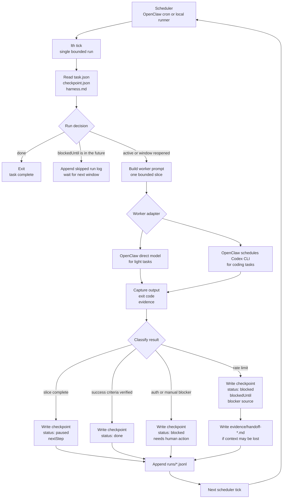

# Longtask Harness

Longtask Harness is a checkpoint-first protocol for AI work that cannot be finished in one sitting.

It treats long tasks as resumable systems: a task contract, a checkpoint, an execution harness, append-only run logs, and evidence. The first target is coding work driven by OpenClaw, Minimax, and Codex CLI. The same pattern should also work for video analysis, editing, research, migration projects, and other slow, bounded workflows.

## Why

Most agent workflows fail quietly when they get long: context drifts, rate limits reset the operator's memory, and "continue" becomes a vibe rather than a contract.

This repo explores a stricter harness engineering approach:

- Define the task before running the worker.
- Keep each run bounded and inspectable.
- Persist progress in a machine-readable checkpoint.
- Record evidence before claiming progress.
- Allow different workers to resume the same task.
- Respect rate limits by pausing and resuming, not retrying blindly.

## Core Files

Each long task lives in a directory with these files:

```text
task.json          Machine-readable task contract.
checkpoint.json    Current state, next step, blockers, and evidence index.
harness.md         Human-readable operating procedure and safety rules.
runs/              Append-only JSONL run logs.
artifacts/         Generated outputs.
evidence/          Tests, screenshots, transcripts, clips, and review notes.
```

## System Flow



## Quick Start

Validate the included examples:

```bash
npm test
```

Create a task skeleton:

```bash
node src/cli.js init tasks/my-coding-task --template coding
node src/cli.js validate tasks/my-coding-task
node src/cli.js next tasks/my-coding-task
```

Record progress:

```bash
node src/cli.js record tasks/my-coding-task \
  --status paused \
  --note "Implemented parser skeleton; next run should add adapter tests."
```

## OpenClaw Integration Shape

There are two useful execution modes.

Mode A: OpenClaw direct model worker

OpenClaw runs the task with its configured provider, such as `minimax/MiniMax-M2.5`. This is good for light to medium coding, planning, repo grooming, and media analysis orchestration.

Mode B: OpenClaw schedules Codex CLI

OpenClaw acts as the scheduler and harness reader, then spawns Codex CLI inside a trusted git repo for heavier coding. This uses the local Codex CLI login/subscription path rather than an OpenAI API key, and should pause cleanly when Codex is rate limited.

See [docs/OPENCLAW_CODEX_PIPELINE.md](docs/OPENCLAW_CODEX_PIPELINE.md).

## Status

This is an early portfolio project scaffold. The near-term goal is to prove the harness contract with real coding tasks, then generalize to media workflows.

---

# Longtask Harness 中文说明

Longtask Harness 是一个 checkpoint-first 的长任务协议，面向无法一次完成的 AI 工作。

它把长任务看成一个可恢复系统：任务契约、checkpoint、执行 harness、append-only run log 和证据记录共同描述“要做什么、做到哪里、下一步怎么继续”。当前第一目标是支持由 OpenClaw、Minimax 和 Codex CLI 驱动的 coding 工作；同一套模式也可以扩展到视频分析、剪辑、研究、迁移项目和其他需要分阶段推进的工作流。

## 为什么需要它

长任务里的 agent workflow 经常不是因为某一步不会做而失败，而是因为任务拖长之后状态丢了：context 漂移、rate limit 打断之后没人记得进度，“继续”变成一种模糊感觉，而不是一个可靠契约。

这个 repo 探索一种更严格的 harness engineering 方法：

- 在运行 worker 之前先定义任务。
- 每次运行只做一个有边界、可检查的 slice。
- 把进度保存在机器可读的 checkpoint 里。
- 声称完成之前先记录证据。
- 允许不同 worker 接手同一个任务。
- 遇到 rate limit 时暂停并等待下个窗口，而不是盲目重试。

## 核心文件

每个长任务都放在一个独立目录里，包含这些文件：

```text
task.json          机器可读的任务契约。
checkpoint.json    当前状态、下一步、blocker 和证据索引。
harness.md         人类可读的操作规则和安全约束。
runs/              append-only JSONL 运行日志。
artifacts/         生成的输出。
evidence/          测试、截图、转录、视频片段和 review notes。
```

## 快速开始

验证内置 examples：

```bash
npm test
```

创建一个任务骨架：

```bash
node src/cli.js init tasks/my-coding-task --template coding
node src/cli.js validate tasks/my-coding-task
node src/cli.js next tasks/my-coding-task
```

记录进度：

```bash
node src/cli.js record tasks/my-coding-task \
  --status paused \
  --note "Implemented parser skeleton; next run should add adapter tests."
```

## Harness 在这里的含义

这里的 harness 不是狭义的测试 harness，而是约束长任务运行方式的外壳。

```text
worker    = 真正干活的人、模型、OpenClaw direct worker 或 Codex CLI
harness   = 让 worker 可恢复、可审计、可暂停的运行协议
scheduler = 定期唤醒 harness 的东西，例如 OpenClaw cron
```

理想 flow 是：

1. scheduler 定期醒来。
2. harness 读取 `task.json`、`checkpoint.json` 和 `harness.md`。
3. 如果任务已经 `done`，直接退出。
4. 如果任务处于 `blocked` 且 `blockedUntil` 还没到，记录 skipped run 并退出。
5. 如果窗口已经恢复，启动 worker 做一个 bounded slice。
6. 捕获 worker 输出、exit status 和证据。
7. 分类结果，例如成功、测试失败、auth error 或 rate limit。
8. 更新 checkpoint 和 run log。

## Rate Limit 下的自动暂停与恢复

理想状态机：

```text
active -> running -> paused
                -> blocked(rate_limit, blockedUntil)
                -> done
                -> blocked(auth/error/manual)
blocked + now >= blockedUntil -> active
paused + scheduler tick -> active
```

遇到 rate limit 时，系统应该把它当成正常 blocker，而不是普通异常：

- 停止调用受限 provider。
- 记录 rate limit 事件到 `runs/*.jsonl`。
- 更新 `checkpoint.status = blocked`。
- 设置 `blockedUntil`。
- 写清楚下一步 `nextStep`。
- 必要时写 `evidence/handoff-*.md`。
- 退出，等待下一次 scheduler tick。

重要的是区分 rate limit 来源：

| Source | 含义 | 恢复策略 |
|---|---|---|
| `openclaw-provider` | OpenClaw 当前模型 provider 被限流，例如 Minimax | 外层 runner 必须保存状态并等待窗口恢复 |
| `codex-cli` | OpenClaw 还能运行，但它启动的 Codex CLI 被限流 | OpenClaw 或 runner 可以整理 handoff 并更新 checkpoint |
| `scheduler` | OpenClaw cron、gateway 或 session 层异常 | 需要单独诊断，不能直接当成模型窗口问题 |

## Context 如何保存

Rate limit 时不应该把整段聊天全部塞进 checkpoint，而应该分层保存：

- `checkpoint.json`：保存当前 phase、下一步、`blockedUntil`、blocker、active files、open questions 和 evidence 引用。
- `runs/*.jsonl`：保存 append-only 事件流，例如 run started、step completed、command result、failure classified。
- `evidence/handoff-*.md`：保存给下一个人或 AI worker 读的短摘要。
- `git diff`：对 coding task 来说，这是最真实的代码上下文；checkpoint 只解释它的意图和下一步。

## OpenClaw 集成形态

有两种主要执行模式。

Mode A: OpenClaw direct model worker

OpenClaw 直接使用配置好的 provider 运行一个 bounded slice，例如 `minimax/MiniMax-M2.5`。适合轻到中等 coding、规划、repo 整理和媒体分析编排。

Mode B: OpenClaw schedules Codex CLI

OpenClaw 作为 scheduler 和 harness reader，在受信任的 git repo 中启动 Codex CLI 做更重的 coding 工作。这个模式使用本地 Codex CLI login/subscription 路径，而不是 OpenAI API key；当 Codex 被 rate limited 时，应当干净暂停，而不是密集重试。

更多细节见 [docs/OPENCLAW_CODEX_PIPELINE.md](docs/OPENCLAW_CODEX_PIPELINE.md)。

## 当前状态

这个项目目前仍处于早期 scaffold 阶段。已经有任务契约、checkpoint schema、基础 CLI 和 examples；下一步目标是实现真正的 rate limit aware runner，例如：

- `lth record --status blocked --blocked-until <iso> --reason rate_limit`
- `lth next` 输出 `decision: run | wait | done | needs-human`
- `lth tick` 做单次调度、执行、分类、checkpoint 更新和 run log 记录
- OpenClaw cron recipe generator
- Codex CLI worker prompt generator
- rate limit / auth / test failure classifier
