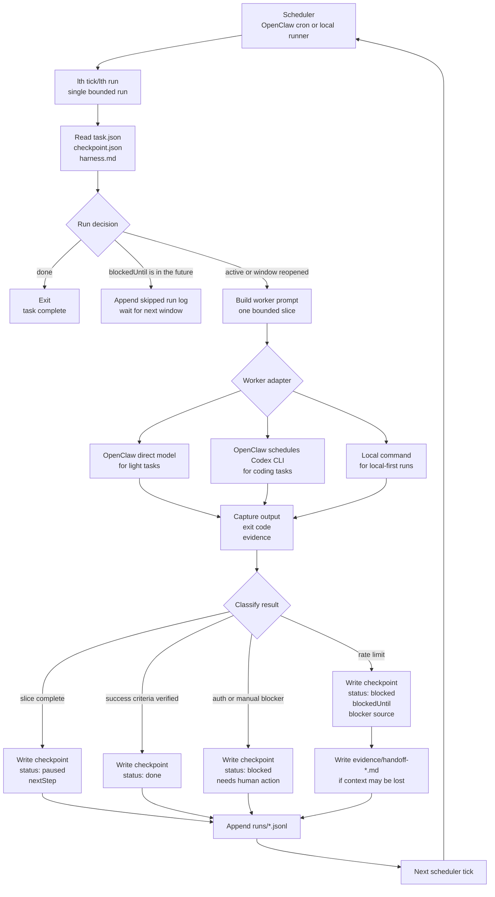

# Longtask Harness

[中文说明](README.CN.md)

Longtask Harness is a checkpoint-first protocol for AI work that cannot be finished in one sitting.

It treats long tasks as resumable systems: a task contract, a checkpoint, an execution harness, append-only run logs, and evidence. The first target is coding work driven by OpenClaw, Minimax, and Codex CLI. The same pattern should also work for video analysis, editing, research, migration projects, and other slow, bounded workflows.

## Why

Most agent workflows fail quietly when they get long: context drifts, rate limits reset the operator's memory, and "continue" becomes a vibe rather than a contract.

This repo explores a stricter harness engineering approach:

- Define the task before running the worker.
- Keep each run bounded and inspectable.
- Persist progress in a machine-readable checkpoint.
- Record evidence before claiming progress.
- Allow different workers to resume the same task.
- Respect rate limits by pausing and resuming, not retrying blindly.

## Core Files

Each long task lives in a directory with these files:

```text
task.json          Machine-readable task contract.
checkpoint.json    Current state, next step, blockers, and evidence index.
harness.md         Human-readable operating procedure and safety rules.
runs/              Append-only JSONL run logs.
artifacts/         Generated outputs.
evidence/          Tests, screenshots, transcripts, clips, and review notes.
```

## System Flow



## User Guidelines

Before a long task can run safely, the user should define the parts that the harness cannot infer from tool output alone.

Put durable task intent in `task.json`:

- `objective`: the concrete outcome, not just the activity.
- `successCriteria`: verifiable checks that tell a future worker when the task is done.
- `constraints`: scope limits, safety rules, budget rules, forbidden paths, and anything that must not be changed.
- `scheduler`: which scheduler wakes the task, such as `openclaw-cron` or `manual`.
- `workerPolicy`: which workers are preferred or allowed, such as `codex-cli`, `kimi-cli`, `local-command`, or `manual-review`.

Put operating rules in `harness.md`:

- Setup and verification commands.
- Where generated artifacts, evidence, logs, screenshots, transcripts, or patches should go.
- How large one bounded slice should be, for example one test, one refactor, one scene, or one document section.
- What evidence is required before a worker can mark a slice complete.
- What requires human review instead of automatic continuation.
- Any repo-specific safety notes, such as trusted working directories or files that should not be edited.

Put the initial recovery state in `checkpoint.json`:

- `currentPhase`: the first phase the worker should enter.
- `nextStep`: the first concrete action.
- `status`: usually `active`.
- `blockedUntil`: `null` unless the task is intentionally waiting.
- `evidence`: an empty list or references to already-known context.

For rate-limit-aware runs, the user should also choose the pause policy:

- Which rate limit sources matter: OpenClaw provider, Codex CLI, scheduler, or external APIs.
- The conservative fallback wait time when the provider does not return a reset time.
- Whether another worker may continue lightweight handoff work when the main worker is rate limited.
- When a blocker should become `needs-human` instead of automatic retry.

The harness can preserve state, classify failures, and resume work, but the user owns the task definition: what success means, what must stay inside the guardrails, and when automation should stop.

The JSON files are schema-backed. `schemaVersion` must be `1`; newer versions should add an explicit migration before the harness loads them.

Evidence items also have a small shared shape. `type` is required, while `path`, `criterionId`, `criteria`, `observedAt`, `source`, `command`, `exitCode`, `status`, `text`, `output`, `note`, and `summary` let workers connect raw evidence to success criteria.

## Quick Start

Validate the included examples:

```bash
npm test
```

Create a task skeleton:

```bash
node src/cli.js init tasks/my-coding-task --template coding
node src/cli.js validate tasks/my-coding-task
node src/cli.js next tasks/my-coding-task
node src/cli.js tick tasks/my-coding-task --dry-run
```

Create a configured OpenClaw + Codex task with Kimi fallback and run startup checks:

```bash
node src/cli.js init tasks/my-coding-task \
  --template coding \
  --scheduler openclaw-cron \
  --worker codex-cli \
  --fallback-worker kimi-cli \
  --cwd /path/to/trusted/repo \
  --check
```

Record progress:

```bash
node src/cli.js record tasks/my-coding-task \
  --status paused \
  --note "Implemented parser skeleton; next run should add adapter tests."
```

Record a rate-limit pause:

```bash
node src/cli.js record tasks/my-coding-task \
  --status blocked \
  --reason rate_limit \
  --source codex-cli \
  --retry-after-seconds 14400 \
  --note "Codex CLI rate limited while adding parser tests; resume from the same slice."
```

Classify captured worker output:

```bash
node src/cli.js classify tasks/my-coding-task \
  --text "Codex CLI returned 429 Too Many Requests. Retry after 120 seconds."
```

Record structured evidence:

```bash
node src/cli.js evidence tasks/my-coding-task \
  --type review-note \
  --criterion-id changes-logged \
  --summary "Reviewed the run log and linked the behavior change."
```

Verify success criteria before claiming completion:

```bash
node src/cli.js verify tasks/my-coding-task
```

Run adapter health checks:

```bash
node src/cli.js health tasks/my-coding-task
```

Run one bounded worker slice with a local command:

```bash
node src/cli.js run tasks/my-coding-task \
  --worker local-command \
  --command "ollama run qwen2.5-coder:32b"
```

`lth run` creates a short-lived `.lth.lock` file before starting a worker. If another worker already holds the lock, the command returns `decision: "wait"` and does not start a second worker. Expired locks are cleared automatically.

Run one bounded worker slice with Codex CLI:

```bash
node src/cli.js run tasks/my-coding-task \
  --worker codex-cli \
  --cwd /path/to/trusted/repo
```

Generate an OpenClaw cron recipe:

```bash
node src/cli.js openclaw-recipe tasks/my-coding-task --every 30m
```

Inspect the recorded local resume demo:

```bash
node src/cli.js verify examples/resume-demo
node src/cli.js summary examples/resume-demo
node src/cli.js tail examples/resume-demo --limit 5
```

## Testing Workflow

Run the full smoke suite before committing:

```bash
npm test
```

The smoke suite copies example tasks into temporary directories and verifies both happy paths and rate-limit boundaries:

- examples validate successfully
- `next` returns `run` for active work
- `tick --dry-run` generates a worker prompt without writing run logs
- `record --status blocked --retry-after-seconds ...` makes `next` return `wait`
- waiting ticks append `tick_started` and `run_skipped`
- blocked tasks without `blockedUntil` become `needs-human`
- explicit `needs-human` status stops automation
- expired `blockedUntil` reopens the task and clears the blocker
- `classify` detects rate limits, auth errors, test failures, and missing context
- `classify --record` updates checkpoint state and run events
- `evidence` records a manifest, updates checkpoint evidence, and appends run events
- `verify` checks command, output, and manual success criteria
- `record --status done` rejects unverified completion claims
- schema validation rejects unsupported `schemaVersion` values and malformed evidence
- `run --worker local-command` executes a bounded local command, captures output, and writes checkpoint state
- failed local workers are classified and recorded
- Codex workers default to `read-only` sandbox and reject forbidden working directories
- active task locks make `run` wait instead of starting overlapping workers
- expired task locks are reclaimed and released after the run
- `health` reports adapter readiness without making local CLI tools mandatory for tests
- `openclaw-recipe` emits a cron command
- fresh `init` output validates and can be dry-run ticked

Testing rules:

- Do not mutate `examples/` during boundary tests; copy them to a temporary directory.
- Add a smoke assertion for every new checkpoint status, run decision, or run event type.
- Prefer CLI-level tests for protocol behavior, because the repo is intentionally dependency-free.
- Keep `npm test` fast enough to run before every commit.

## OpenClaw Integration Shape

There are three useful execution modes.

Mode A: OpenClaw direct model worker

OpenClaw runs the task with its configured provider, such as `minimax/MiniMax-M2.5`. This is good for light to medium coding, planning, repo grooming, and media analysis orchestration.

Mode B: OpenClaw schedules Codex CLI

OpenClaw acts as the scheduler and harness reader, then spawns Codex CLI inside a trusted git repo for heavier coding. This uses the local Codex CLI login/subscription path rather than an OpenAI API key, and should pause cleanly when Codex is rate limited.

See [docs/OPENCLAW_CODEX_PIPELINE.md](docs/OPENCLAW_CODEX_PIPELINE.md). For the adapter boundary that lets the harness scale beyond OpenClaw + Codex CLI, see [docs/ADAPTER_ARCHITECTURE.md](docs/ADAPTER_ARCHITECTURE.md).

Mode C: Local command worker

The harness can run a local command directly with `lth run --worker local-command`. The generated worker prompt is passed on stdin, so this can wrap local models such as Ollama or LM Studio shims, small scripts, or any CLI agent that can read instructions from stdin. This path keeps the protocol independent from cloud services; cloud-backed workers are optional adapters.

## Status

This is an early portfolio project scaffold. The near-term goal is to prove the harness contract with real coding tasks, then generalize to media workflows.

The current hardening review is tracked in [docs/REVIEW_PRIORITIES.md](docs/REVIEW_PRIORITIES.md). The first hardening passes add verified `done` claims, interruption-safe JSON writes and lock acquisition, safer Codex worker defaults, and schema-backed validation.
