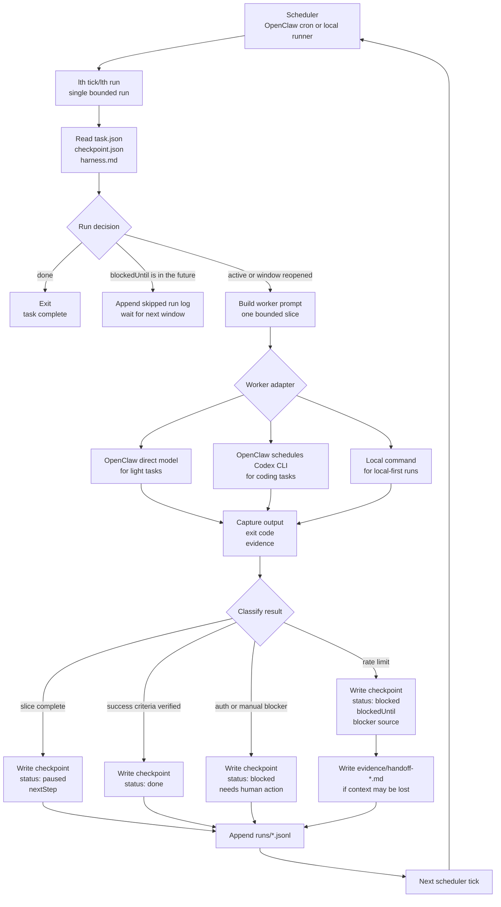

# Longtask Harness

Longtask Harness is a checkpoint-first protocol for AI work that cannot be finished in one sitting.

It treats long tasks as resumable systems: a task contract, a checkpoint, an execution harness, append-only run logs, and evidence. The first target is coding work driven by OpenClaw, Minimax, and Codex CLI. The same pattern should also work for video analysis, editing, research, migration projects, and other slow, bounded workflows.

## Why

Most agent workflows fail quietly when they get long: context drifts, rate limits reset the operator's memory, and "continue" becomes a vibe rather than a contract.

This repo explores a stricter harness engineering approach:

- Define the task before running the worker.
- Keep each run bounded and inspectable.
- Persist progress in a machine-readable checkpoint.
- Record evidence before claiming progress.
- Allow different workers to resume the same task.
- Respect rate limits by pausing and resuming, not retrying blindly.

## Core Files

Each long task lives in a directory with these files:

```text
task.json          Machine-readable task contract.
checkpoint.json    Current state, next step, blockers, and evidence index.
harness.md         Human-readable operating procedure and safety rules.
runs/              Append-only JSONL run logs.
artifacts/         Generated outputs.
evidence/          Tests, screenshots, transcripts, clips, and review notes.
```

## System Flow



## User Guidelines

Before a long task can run safely, the user should define the parts that the harness cannot infer from tool output alone.

Put durable task intent in `task.json`:

- `objective`: the concrete outcome, not just the activity.
- `successCriteria`: verifiable checks that tell a future worker when the task is done.
- `constraints`: scope limits, safety rules, budget rules, forbidden paths, and anything that must not be changed.
- `scheduler`: which scheduler wakes the task, such as `openclaw-cron` or `manual`.
- `workerPolicy`: which workers are preferred or allowed, such as `codex-cli`, `kimi-cli`, `local-command`, or `manual-review`.

Put operating rules in `harness.md`:

- Setup and verification commands.
- Where generated artifacts, evidence, logs, screenshots, transcripts, or patches should go.
- How large one bounded slice should be, for example one test, one refactor, one scene, or one document section.
- What evidence is required before a worker can mark a slice complete.
- What requires human review instead of automatic continuation.
- Any repo-specific safety notes, such as trusted working directories or files that should not be edited.

Put the initial recovery state in `checkpoint.json`:

- `currentPhase`: the first phase the worker should enter.
- `nextStep`: the first concrete action.
- `status`: usually `active`.
- `blockedUntil`: `null` unless the task is intentionally waiting.
- `evidence`: an empty list or references to already-known context.

For rate-limit-aware runs, the user should also choose the pause policy:

- Which rate limit sources matter: OpenClaw provider, Codex CLI, scheduler, or external APIs.
- The conservative fallback wait time when the provider does not return a reset time.
- Whether another worker may continue lightweight handoff work when the main worker is rate limited.
- When a blocker should become `needs-human` instead of automatic retry.

The harness can preserve state, classify failures, and resume work, but the user owns the task definition: what success means, what must stay inside the guardrails, and when automation should stop.

## Quick Start

Validate the included examples:

```bash
npm test
```

Create a task skeleton:

```bash
node src/cli.js init tasks/my-coding-task --template coding
node src/cli.js validate tasks/my-coding-task
node src/cli.js next tasks/my-coding-task
node src/cli.js tick tasks/my-coding-task --dry-run
```

Create a configured OpenClaw + Codex task with Kimi fallback and run startup checks:

```bash
node src/cli.js init tasks/my-coding-task \
  --template coding \
  --scheduler openclaw-cron \
  --worker codex-cli \
  --fallback-worker kimi-cli \
  --cwd /path/to/trusted/repo \
  --check
```

Record progress:

```bash
node src/cli.js record tasks/my-coding-task \
  --status paused \
  --note "Implemented parser skeleton; next run should add adapter tests."
```

Record a rate-limit pause:

```bash
node src/cli.js record tasks/my-coding-task \
  --status blocked \
  --reason rate_limit \
  --source codex-cli \
  --retry-after-seconds 14400 \
  --note "Codex CLI rate limited while adding parser tests; resume from the same slice."
```

Classify captured worker output:

```bash
node src/cli.js classify tasks/my-coding-task \
  --text "Codex CLI returned 429 Too Many Requests. Retry after 120 seconds."
```

Verify success criteria before claiming completion:

```bash
node src/cli.js verify tasks/my-coding-task
```

Run adapter health checks:

```bash
node src/cli.js health tasks/my-coding-task
```

Run one bounded worker slice with a local command:

```bash
node src/cli.js run tasks/my-coding-task \
  --worker local-command \
  --command "ollama run qwen2.5-coder:32b"
```

`lth run` creates a short-lived `.lth.lock` file before starting a worker. If another worker already holds the lock, the command returns `decision: "wait"` and does not start a second worker. Expired locks are cleared automatically.

Run one bounded worker slice with Codex CLI:

```bash
node src/cli.js run tasks/my-coding-task \
  --worker codex-cli \
  --cwd /path/to/trusted/repo
```

Generate an OpenClaw cron recipe:

```bash
node src/cli.js openclaw-recipe tasks/my-coding-task --every 30m
```

## Testing Workflow

Run the full smoke suite before committing:

```bash
npm test
```

The smoke suite copies example tasks into temporary directories and verifies both happy paths and rate-limit boundaries:

- examples validate successfully
- `next` returns `run` for active work
- `tick --dry-run` generates a worker prompt without writing run logs
- `record --status blocked --retry-after-seconds ...` makes `next` return `wait`
- waiting ticks append `tick_started` and `run_skipped`
- blocked tasks without `blockedUntil` become `needs-human`
- explicit `needs-human` status stops automation
- expired `blockedUntil` reopens the task and clears the blocker
- `classify` detects rate limits, auth errors, test failures, and missing context
- `classify --record` updates checkpoint state and run events
- `run --worker local-command` executes a bounded local command, captures output, and writes checkpoint state
- failed local workers are classified and recorded
- active task locks make `run` wait instead of starting overlapping workers
- expired task locks are reclaimed and released after the run
- `health` reports adapter readiness without making local CLI tools mandatory for tests
- `openclaw-recipe` emits a cron command
- fresh `init` output validates and can be dry-run ticked

Testing rules:

- Do not mutate `examples/` during boundary tests; copy them to a temporary directory.
- Add a smoke assertion for every new checkpoint status, run decision, or run event type.
- Prefer CLI-level tests for protocol behavior, because the repo is intentionally dependency-free.
- Keep `npm test` fast enough to run before every commit.

## OpenClaw Integration Shape

There are two useful execution modes.

Mode A: OpenClaw direct model worker

OpenClaw runs the task with its configured provider, such as `minimax/MiniMax-M2.5`. This is good for light to medium coding, planning, repo grooming, and media analysis orchestration.

Mode B: OpenClaw schedules Codex CLI

OpenClaw acts as the scheduler and harness reader, then spawns Codex CLI inside a trusted git repo for heavier coding. This uses the local Codex CLI login/subscription path rather than an OpenAI API key, and should pause cleanly when Codex is rate limited.

See [docs/OPENCLAW_CODEX_PIPELINE.md](docs/OPENCLAW_CODEX_PIPELINE.md). For the adapter boundary that lets the harness scale beyond OpenClaw + Codex CLI, see [docs/ADAPTER_ARCHITECTURE.md](docs/ADAPTER_ARCHITECTURE.md).

Mode C: Local command worker

The harness can run a local command directly with `lth run --worker local-command`. The generated worker prompt is passed on stdin, so this can wrap local models such as Ollama or LM Studio shims, small scripts, or any CLI agent that can read instructions from stdin. This path keeps the protocol independent from cloud services; cloud-backed workers are optional adapters.

## Status

This is an early portfolio project scaffold. The near-term goal is to prove the harness contract with real coding tasks, then generalize to media workflows.

The current hardening review is tracked in [docs/REVIEW_PRIORITIES.md](docs/REVIEW_PRIORITIES.md). The first hardening pass adds verified `done` claims, interruption-safe JSON writes and lock acquisition, and safer Codex worker defaults.

---

# Longtask Harness 中文说明

Longtask Harness 是一个 checkpoint-first 的长任务协议，面向无法一次完成的 AI 工作。

它把长任务看成一个可恢复系统：任务契约、checkpoint、执行 harness、append-only run log 和证据记录共同描述“要做什么、做到哪里、下一步怎么继续”。当前第一目标是支持由 OpenClaw、Minimax 和 Codex CLI 驱动的 coding 工作；同一套模式也可以扩展到视频分析、剪辑、研究、迁移项目和其他需要分阶段推进的工作流。

## 为什么需要它

长任务里的 agent workflow 经常不是因为某一步不会做而失败，而是因为任务拖长之后状态丢了：context 漂移、rate limit 打断之后没人记得进度，“继续”变成一种模糊感觉，而不是一个可靠契约。

这个 repo 探索一种更严格的 harness engineering 方法：

- 在运行 worker 之前先定义任务。
- 每次运行只做一个有边界、可检查的 slice。
- 把进度保存在机器可读的 checkpoint 里。
- 声称完成之前先记录证据。
- 允许不同 worker 接手同一个任务。
- 遇到 rate limit 时暂停并等待下个窗口，而不是盲目重试。

## 核心文件

每个长任务都放在一个独立目录里，包含这些文件：

```text
task.json          机器可读的任务契约。
checkpoint.json    当前状态、下一步、blocker 和证据索引。
harness.md         人类可读的操作规则和安全约束。
runs/              append-only JSONL 运行日志。
artifacts/         生成的输出。
evidence/          测试、截图、转录、视频片段和 review notes。
```

## 用户需要定义什么

在长任务可以安全自动运行之前，用户需要定义 harness 不能从工具输出里可靠推断的部分。

写进 `task.json` 的是稳定任务意图：

- `objective`：明确结果，而不只是“做某类工作”。
- `successCriteria`：可验证的完成标准，让未来 worker 知道什么时候可以结束。
- `constraints`：范围限制、安全规则、预算规则、禁止路径，以及任何不能被改动的东西。
- `workerPolicy`：允许或偏好的 worker，例如 `openclaw-direct-model`、`openclaw-codex-cli` 或 `manual-review`。

写进 `harness.md` 的是运行规则：

- 环境准备和验证命令。
- artifacts、evidence、logs、screenshots、transcripts 或 patches 应该放在哪里。
- 一个 bounded slice 应该多大，例如一个测试、一次 refactor、一个视频场景或一个文档章节。
- worker 标记 slice 完成之前必须提供什么证据。
- 哪些情况必须人工 review，而不是自动继续。
- repo-specific safety notes，例如可信工作目录或不应该编辑的文件。

初始化到 `checkpoint.json` 的是恢复状态：

- `currentPhase`：worker 应该进入的第一阶段。
- `nextStep`：第一步具体动作。
- `status`：通常是 `active`。
- `blockedUntil`：除非任务本来就在等待，否则设为 `null`。
- `evidence`：空列表，或已经存在的上下文引用。

如果任务需要 rate-limit-aware 运行，用户还应该定义暂停策略：

- 需要识别哪些 rate limit 来源：OpenClaw provider、Codex CLI、scheduler 或外部 API。
- provider 没有返回 reset time 时，使用多保守的 fallback wait time。
- 主 worker 被限流时，是否允许另一个 worker 继续做轻量 handoff 整理。
- 什么 blocker 应该进入 `needs-human`，而不是自动重试。

harness 可以保存状态、分类失败并恢复工作，但任务定义仍然属于用户：什么叫成功、边界在哪里、自动化什么时候应该停。

## 快速开始

验证内置 examples：

```bash
npm test
```

创建一个任务骨架：

```bash
node src/cli.js init tasks/my-coding-task --template coding
node src/cli.js validate tasks/my-coding-task
node src/cli.js next tasks/my-coding-task
node src/cli.js tick tasks/my-coding-task --dry-run
```

记录进度：

```bash
node src/cli.js record tasks/my-coding-task \
  --status paused \
  --note "Implemented parser skeleton; next run should add adapter tests."
```

记录一次 rate limit 暂停：

```bash
node src/cli.js record tasks/my-coding-task \
  --status blocked \
  --reason rate_limit \
  --source codex-cli \
  --retry-after-seconds 14400 \
  --note "Codex CLI rate limited while adding parser tests; resume from the same slice."
```

分类捕获到的 worker 输出：

```bash
node src/cli.js classify tasks/my-coding-task \
  --text "Codex CLI returned 429 Too Many Requests. Retry after 120 seconds."
```

声称完成前验证 success criteria：

```bash
node src/cli.js verify tasks/my-coding-task
```

运行 adapter health checks：

```bash
node src/cli.js health tasks/my-coding-task
```

用本地命令运行一个 bounded worker slice：

```bash
node src/cli.js run tasks/my-coding-task \
  --worker local-command \
  --command "ollama run qwen2.5-coder:32b"
```

`lth run` 启动 worker 前会创建短生命周期的 `.lth.lock` 文件。如果另一个 worker 已经持有 lock，命令会返回 `decision: "wait"`，不会启动第二个 worker。过期 lock 会自动清理并接管。

用 Codex CLI 运行一个 bounded worker slice：

```bash
node src/cli.js run tasks/my-coding-task \
  --worker codex-cli \
  --cwd /path/to/trusted/repo
```

生成 OpenClaw cron recipe：

```bash
node src/cli.js openclaw-recipe tasks/my-coding-task --every 30m
```

## 测试流程

提交前运行完整 smoke suite：

```bash
npm test
```

smoke suite 会把 example task 复制到临时目录里测试，覆盖 happy path 和 rate-limit 边界：

- examples 可以成功 validate。
- `next` 对 active work 返回 `run`。
- `tick --dry-run` 会生成 worker prompt，但不会写 run logs。
- `record --status blocked --retry-after-seconds ...` 会让 `next` 返回 `wait`。
- 等待中的 tick 会追加 `tick_started` 和 `run_skipped`。
- 没有 `blockedUntil` 的 blocked task 会进入 `needs-human`。
- 显式 `needs-human` 状态会停止自动化。
- 已过期的 `blockedUntil` 会重新打开任务并清空 blocker。
- `classify` 会识别 rate limit、auth error、test failure 和 missing context。
- `classify --record` 会更新 checkpoint state 和 run events。
- `run --worker local-command` 会运行一个本地 bounded worker slice、捕获输出并写 checkpoint state。
- 失败的本地 worker 会被分类并记录。
- active task lock 会让 `run` 等待，不会启动重叠 worker。
- 过期 task lock 会被接管，并在 run 结束后释放。
- `health` 会报告 adapter readiness，但测试不会强制本机必须安装所有 CLI。
- `openclaw-recipe` 会生成 cron command。
- 新 `init` 出来的任务可以 validate，也可以 dry-run tick。

测试规则：

- 边界测试不要直接修改 `examples/`，先复制到临时目录。
- 每新增一种 checkpoint status、run decision 或 run event type，都要补 smoke assertion。
- 协议行为优先用 CLI-level test 覆盖，因为这个 repo 刻意保持 dependency-free。
- `npm test` 要足够快，适合每次 commit 前运行。

## Harness 在这里的含义

这里的 harness 不是狭义的测试 harness，而是约束长任务运行方式的外壳。

```text
worker    = 真正干活的人、模型、OpenClaw direct worker 或 Codex CLI
harness   = 让 worker 可恢复、可审计、可暂停的运行协议
scheduler = 定期唤醒 harness 的东西，例如 OpenClaw cron
```

理想 flow 是：

1. scheduler 定期醒来。
2. harness 读取 `task.json`、`checkpoint.json` 和 `harness.md`。
3. 如果任务已经 `done`，直接退出。
4. 如果任务处于 `blocked` 且 `blockedUntil` 还没到，记录 skipped run 并退出。
5. 如果窗口已经恢复，启动 worker 做一个 bounded slice。
6. 捕获 worker 输出、exit status 和证据。
7. 分类结果，例如成功、测试失败、auth error 或 rate limit。
8. 更新 checkpoint 和 run log。

## Rate Limit 下的自动暂停与恢复

理想状态机：

```text
active -> running -> paused
                -> blocked(rate_limit, blockedUntil)
                -> done
                -> blocked(auth/error/manual)
blocked + now >= blockedUntil -> active
paused + scheduler tick -> active
```

遇到 rate limit 时，系统应该把它当成正常 blocker，而不是普通异常：

- 停止调用受限 provider。
- 记录 rate limit 事件到 `runs/*.jsonl`。
- 更新 `checkpoint.status = blocked`。
- 设置 `blockedUntil`。
- 写清楚下一步 `nextStep`。
- 必要时写 `evidence/handoff-*.md`。
- 退出，等待下一次 scheduler tick。

重要的是区分 rate limit 来源：

| Source | 含义 | 恢复策略 |
|---|---|---|
| `openclaw-provider` | OpenClaw 当前模型 provider 被限流，例如 Minimax | 外层 runner 必须保存状态并等待窗口恢复 |
| `codex-cli` | OpenClaw 还能运行，但它启动的 Codex CLI 被限流 | OpenClaw 或 runner 可以整理 handoff 并更新 checkpoint |
| `scheduler` | OpenClaw cron、gateway 或 session 层异常 | 需要单独诊断，不能直接当成模型窗口问题 |

## Context 如何保存

Rate limit 时不应该把整段聊天全部塞进 checkpoint，而应该分层保存：

- `checkpoint.json`：保存当前 phase、下一步、`blockedUntil`、blocker、active files、open questions 和 evidence 引用。
- `checkpoint.workerCooldowns`：保存单个 worker 的临时 cooldown，例如 `codex-cli` rate limit reset 时间；任务可以在这段时间降级到 fallback worker。
- `runs/*.jsonl`：保存 append-only 事件流，例如 run started、step completed、command result、failure classified。
- `evidence/handoff-*.md`：保存给下一个人或 AI worker 读的短摘要。
- Codex session trace：当 `codex-cli` 遇到 rate limit 时，checkpoint 的 `evidence` 可以记录本地 `.codex/sessions/...jsonl` 路径，作为必要时深挖的原始轨迹。
- `git diff`：对 coding task 来说，这是最真实的代码上下文；checkpoint 只解释它的意图和下一步。

## OpenClaw 集成形态

有三种主要执行模式。

Mode A: OpenClaw direct model worker

OpenClaw 直接使用配置好的 provider 运行一个 bounded slice，例如 `minimax/MiniMax-M2.5`。适合轻到中等 coding、规划、repo 整理和媒体分析编排。

Mode B: OpenClaw schedules Codex CLI

OpenClaw 作为 scheduler 和 harness reader，在受信任的 git repo 中启动 Codex CLI 做更重的 coding 工作。这个模式使用本地 Codex CLI login/subscription 路径，而不是 OpenAI API key；当 Codex 被 rate limited 时，应当干净暂停，而不是密集重试。

Mode C: local command worker

harness 也可以通过 `lth run --worker local-command` 直接运行本地命令。生成的 worker prompt 会通过 stdin 传给命令，因此可以接 Ollama、LM Studio shim、本地脚本，或任何能从 stdin 读取指令的 CLI agent。这条路径让协议本身不依赖云服务；云端模型只是可选 adapter。

更多细节见 [docs/OPENCLAW_CODEX_PIPELINE.md](docs/OPENCLAW_CODEX_PIPELINE.md)。

## 当前状态

这个项目目前仍处于早期 scaffold 阶段。已经有任务契约、checkpoint schema、基础 CLI、examples，以及初版 worker runner，例如：

- `lth record --status blocked --blocked-until <iso> --reason rate_limit`
- `lth next` 输出 `decision: run | wait | done | needs-human`
- `lth tick` 做单次调度判断和 worker prompt 生成
- `lth verify` 检查 `successCriteria`；`record --status done` 必须先通过 verify
- `lth run --worker local-command|codex-cli` 做单次调度、执行、输出捕获、分类、checkpoint 更新和 run log 记录
- OpenClaw cron recipe generator
- Codex CLI worker prompt generator
- rate limit / auth / test failure classifier
